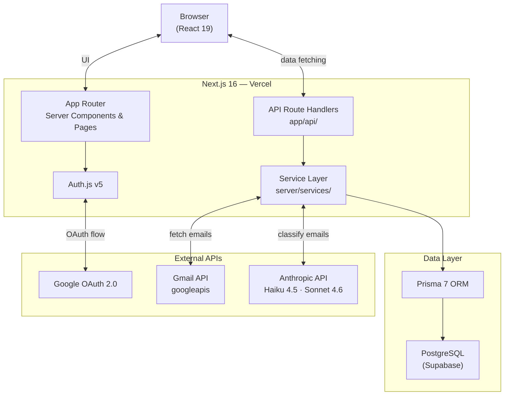

# Application Tracker

Tracks your job applications automatically. Connects to Gmail, reads application emails, and classifies them with Claude AI — so your dashboard stays current without manual entry.


[Live Demo](https://YOUR_VERCEL_URL) · [Report a Bug](https://github.com/Mahib09/application-tracker/issues) · [Request a Feature](https://github.com/Mahib09/application-tracker/issues)

---

## Table of Contents

- [Overview](#overview)
- [Features](#features)
- [How It Works](#how-it-works)
- [Architecture](#architecture)
- [Screenshots](#screenshots)
- [Tech Stack](#tech-stack)
- [Getting Started](#getting-started)
- [Environment Variables](#environment-variables)
- [Scripts](#scripts)
- [Project Structure](#project-structure)
- [Privacy](#privacy)
- [Roadmap](#roadmap)
- [License](#license)

---

## Overview

Job hunting produces a lot of email — confirmations, interview invites, rejections, ghosting. Tracking these manually in a spreadsheet is tedious and incomplete.

Application Tracker connects to your Gmail account, runs application emails through a three-stage AI classification pipeline (deterministic filter → Claude Haiku triage → Claude Sonnet extraction), and organizes them into a dashboard with Kanban and table views. Low-confidence classifications are flagged for your review rather than auto-committed.

Portfolio project, actively maintained.

---

## Features

**Gmail Sync**
- One-click sync via `gmail.readonly` scope — app can never send or delete emails
- 15-minute cooldown prevents excessive API calls
- Intelligent deduplication across sync runs (exact match → role similarity → company-only)
- Automatic OAuth token refresh when expired

**AI Classification**
- Three-stage pipeline: deterministic filter → Haiku triage → Sonnet extraction
- Stage 1 drops newsletters and social media by metadata alone — no AI cost
- Stage 2 (Claude Haiku 4.5) makes a YES / NO / UNCERTAIN call — cheap cost gate
- Stage 3 (Claude Sonnet 4.6) extracts company, role, status, location, and confidence score
- Confidence routing: >0.9 auto-committed · 0.7–0.9 flagged · <0.7 queued for review

**Application Management**
- Kanban board with drag-and-drop across status columns (Applied, Interview, Offer, Rejected, Ghosted, Needs Review)
- Table view with sortable columns and inline field editing
- Status history tracking — records every status change with its trigger source
- 30-day auto-ghost for stale applications with no response
- Context menus and undo toasts for non-destructive actions

**Follow-up Automation**
- Surfaces applications due for follow-up (10-day threshold, 14-day repeat cooldown)
- AI-generated follow-up draft messages via Claude Haiku
- Follow-up history tracking per application

**Analytics**
- Response rate, ghost rate, median response time
- 12-week rolling application volume chart
- Status funnel: applications → interviews → offers with conversion rates
- Source breakdown: Gmail vs. manual entries

**Navigation**
- Command palette (`Ctrl+K` / `⌘K`) for quick search and actions
- Full keyboard navigation throughout the app
- Responsive layout — works on desktop and mobile

**Export**
- CSV and JSON export with full application history

---

## How It Works

```
Gmail Inbox
    │
    ▼
┌──────────────────────────────────────────┐
│  Stage 1 — Deterministic Filter          │  Metadata only. Drops newsletters,
│                                          │  social media, and promotions.
│  Blocklist: LinkedIn, X, Instagram,      │  No AI cost.
│  Facebook, Reddit, Mailchimp, etc.       │
│  Allowlist: known ATS domains            │
└───────────────┬──────────────────────────┘
                │  Job-relevant candidates
                ▼
┌──────────────────────────────────────────┐
│  Stage 2 — Haiku Triage                  │  YES / NO / UNCERTAIN
│  Model: Claude Haiku 4.5                 │  20 emails per batch.
│                                          │  Fails open (UNCERTAIN) on API error.
└───────────────┬──────────────────────────┘
                │  YES emails only
                ▼
┌──────────────────────────────────────────┐
│  Stage 3 — Sonnet Classification         │  Extracts: company, role, status,
│  Model: Claude Sonnet 4.6               │  location, confidence score (0–1).
│                                          │  One API call per email for isolation.
└───────────────┬──────────────────────────┘
                │
                ▼
┌──────────────────────────────────────────┐
│  Confidence Routing                      │  > 0.9   → auto-committed
│                                          │  0.7–0.9 → flagged for review
│                                          │  < 0.7   → NEEDS_REVIEW queue
└──────────────────────────────────────────┘
```

---

## Architecture

<!-- To replace with an Eraser.io exported PNG: save to docs/images/architecture.png and swap the mermaid block below for  -->



**Request path:** All API routes in `app/api/` delegate to `server/services/` — no business logic lives in route handlers. The Prisma client is a singleton (`server/lib/prisma.ts`). Auth uses JWT strategy with no database session adapter.

For deeper details see [docs/architecture.md](docs/architecture.md) and [docs/pipeline.md](docs/pipeline.md).

---

## Screenshots

<!-- Add screenshots to docs/images/ and update the paths below.
     Suggested: dashboard (Kanban), table view, analytics page, command palette. -->

| Dashboard | Analytics |
|-----------|-----------|
|  |  |

---

## Tech Stack

| Layer        | Technology                                               |
|--------------|----------------------------------------------------------|
| Framework    | Next.js 16 (App Router), React 19                       |
| Language     | TypeScript 5.9                                           |
| Styling      | Tailwind CSS v4, shadcn/ui, Radix UI                    |
| Charts       | Recharts                                                 |
| Animation    | Motion                                                   |
| ORM          | Prisma 7                                                 |
| Database     | PostgreSQL (Supabase)                                    |
| Auth         | Auth.js v5, Google OAuth 2.0                            |
| AI           | Anthropic SDK — Claude Haiku 4.5 + Sonnet 4.6           |
| Testing      | Vitest, Testing Library, jsdom                          |
| Deployment   | Vercel                                                   |

---

## Getting Started

### Prerequisites

- Node.js 18+
- PostgreSQL database ([Supabase](https://supabase.com) free tier works)
- Google Cloud project with OAuth 2.0 credentials and Gmail API enabled
- [Anthropic API key](https://console.anthropic.com)

### Installation

```bash
git clone https://github.com/Mahib09/application-tracker.git
cd application-tracker
npm install
```

Copy the environment template:

```bash
cp .env.example .env
```

Fill in your values (see [Environment Variables](#environment-variables) below), then run migrations and start the dev server:

```bash
npx prisma migrate dev
npx prisma generate
npm run dev
```

Open [http://localhost:3000](http://localhost:3000).

---

## Environment Variables

| Variable             | Description                                                              |
|----------------------|--------------------------------------------------------------------------|
| `AUTH_GOOGLE_ID`     | Google OAuth 2.0 client ID                                               |
| `AUTH_GOOGLE_SECRET` | Google OAuth 2.0 client secret                                           |
| `AUTH_SECRET`        | Random string for Auth.js session encryption (`openssl rand -base64 32`) |
| `ANTHROPIC_API_KEY`  | Anthropic API key for Claude Haiku and Sonnet                            |
| `DATABASE_URL`       | PostgreSQL pooler URL (pgbouncer, port 6543) — used at runtime           |
| `DIRECT_URL`         | Direct PostgreSQL URL (`db.<ref>.supabase.co:5432`) — used for migrations only |

See [`.env.example`](.env.example) for the full template.

---

## Scripts

| Command                                | Description                        |
|----------------------------------------|------------------------------------|
| `npm run dev`                          | Start dev server at port 3000      |
| `npm run build`                        | Production build                   |
| `npm run start`                        | Start production server            |
| `npm run lint`                         | Run ESLint                         |
| `npm test`                             | Vitest in watch mode               |
| `npm run test:run`                     | Vitest single run (CI)             |
| `npx prisma migrate dev --name <name>` | Run a new migration                |
| `npx prisma generate`                  | Regenerate Prisma client           |

---

## Project Structure

<details>
<summary>View full directory structure</summary>

```
app/
  api/
    auth/[...nextauth]/    Google OAuth handler
    applications/          CRUD endpoints (index + [id])
    sync/                  Gmail sync trigger + reset
    followups/             Follow-up suggestions
    export/                CSV and JSON export
    health/db              Health check endpoint
  dashboard/
    page.tsx               Main dashboard (Kanban / Table)
    analytics/             Analytics charts page
    review/                NEEDS_REVIEW queue
    followups/             Follow-up suggestions page
    settings/              Account settings
  login/                   Google OAuth login page
  page.tsx                 Landing page
  privacy/                 Privacy policy
  terms/                   Terms of service

components/
  ui/                      shadcn/ui primitives (button, dialog, etc.)
  dashboard/               KanbanBoard, ApplicationTable, CommandPalette,
                           AnalyticsDashboard, WeeklySummary, ReviewQueueClient,
                           FollowUpsClient, SettingsClient
  layout/                  NavSidebar, header
  landing/                 Landing page sections (hero, features, FAQ)

server/
  lib/prisma.ts            Prisma client singleton
  services/
    sync.service.ts        Orchestrates full Gmail sync flow
    gmail.service.ts       Gmail API client and token refresh
    classification/
      filter.ts            Stage 1 — deterministic filter
      triage.ts            Stage 2 — Haiku triage
      classify.ts          Stage 3 — Sonnet classification
    analytics.service.ts   Metrics computation
    followup.service.ts    Follow-up drafting
    export.service.ts      CSV / JSON export
    jd-snapshot.service.ts Job description fetching

lib/                       Client-side utilities and hooks
types/                     Shared TypeScript types
prisma/schema.prisma       Database schema
__tests__/                 Tests (mirrors source structure)
docs/                      Architecture and pipeline design docs
```

</details>

---

## Privacy

This app requests the `gmail.readonly` scope — it cannot send, delete, or modify any email.

Email fetching uses `format: 'minimal'`, which returns only the subject line and snippet. Email body is fetched only during classification and is truncated to 2,000 characters before being sent to the AI. Subject and snippet are discarded immediately after classification; only the extracted fields (company, role, status, location) are saved to the database.

Personal and contact information is stripped from email text before it reaches the Anthropic API.

---

## Roadmap

- [x] Gmail sync with OAuth and automatic token refresh
- [x] Three-stage AI classification pipeline (Haiku triage + Sonnet extraction)
- [x] Kanban board with drag-and-drop
- [x] Table view with inline editing
- [x] Command palette and full keyboard navigation
- [x] Follow-up automation with AI-generated draft messages
- [x] Analytics dashboard (response rate, ghost rate, conversion funnel, 12-week chart)
- [x] CSV and JSON export
- [x] 30-day auto-ghost for stale applications
- [ ] Bulk status updates
- [ ] Email notifications for status changes
- [ ] Browser extension for one-click job saving from job boards

---

## License

[MIT](LICENSE)
